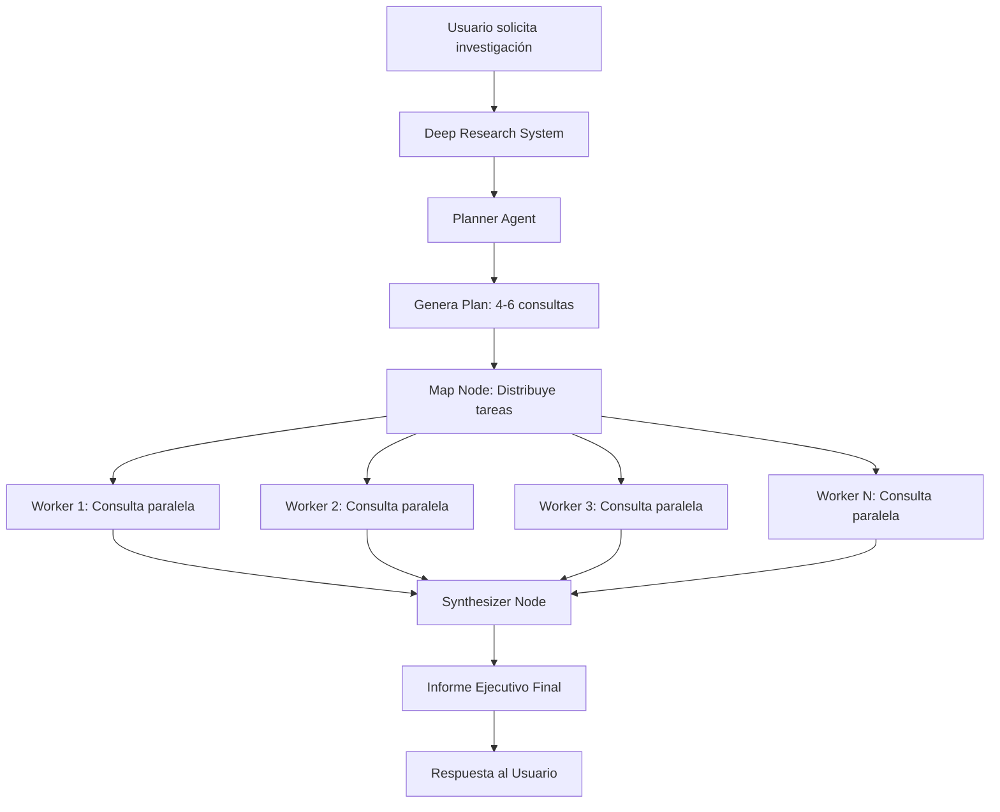

# 🚀 Sistema Deep Research - Documentación Técnica

## 📋 Descripción General

El **Sistema Deep Research** es una implementación avanzada de investigación de mercado que utiliza un equipo especializado de agentes que trabajan en paralelo para proporcionar análisis más profundos y completos para PYMEs.

### 🏗️ Arquitectura: Patrón Map-Reduce



## 🧩 Componentes Principales

### 1. 🧠 DeepResearchPlanner (El Estratega)

**Responsabilidad**: Crear planes de investigación contextuales y específicos.

```python
class DeepResearchPlanner:
    def create_research_plan(self, research_topic: str, business_context: Dict[str, Any]) -> List[str]:
        """
        Genera 4-6 consultas de búsqueda específicas basadas en:
        - Sector de la empresa
        - Ubicación geográfica  
        - Productos/servicios
        - Desafíos específicos
        - Tipo de investigación solicitada
        """
```

**Características**:
- ✅ Consultas específicas al sector y ubicación
- ✅ Orientadas a resultados accionables
- ✅ Balanceadas entre oportunidades y desafíos
- ✅ Incluye análisis competitivo cuando es relevante

### 2. 🔍 Workers Paralelos (Los Ejecutores)

**Responsabilidad**: Ejecutar búsquedas web simultaneas y optimizadas.

```python
@tool
async def search_web_advanced(query: str) -> Dict[str, Any]:
    """
    Herramienta avanzada con:
    - Búsqueda profunda (advanced search depth)
    - 4 resultados por consulta
    - Filtrado inteligente de contenido
    - Manejo de errores y retry logic
    """
```

**Optimizaciones**:
- 🚀 **Paralelización**: Múltiples workers ejecutando simultáneamente
- 🔍 **Búsqueda avanzada**: Configuración Tavily optimizada
- 📊 **Filtrado inteligente**: Solo contenido relevante y sustancial
- ⚡ **Tiempo controlado**: Simulación de tiempo real de búsqueda

### 3. 📊 DeepResearchSynthesizer (El Analista)

**Responsabilidad**: Combinar todos los resultados en un informe ejecutivo.

```python
class DeepResearchSynthesizer:
    def synthesize_research(self, research_topic: str, business_context: Dict[str, Any], 
                          research_results: List[Dict]) -> str:
        """
        Genera informe ejecutivo estructurado:
        1. RESUMEN EJECUTIVO (2-3 líneas clave)
        2. OPORTUNIDADES IDENTIFICADAS (3-4 puntos específicos)
        3. RECOMENDACIONES PRIORITARIAS (3-4 acciones concretas)
        4. PRÓXIMOS PASOS (2-3 acciones inmediatas)
        """
```

## 🔧 Integración con el Sistema Existente

### Herramienta Principal: `perform_deep_research`

```python
@tool
async def perform_deep_research(
    state: Annotated[PYMESState, InjectedState],
    research_topic: str = "análisis general de mercado"
) -> DeepResearchResult:
    """
    Herramienta que reemplaza perform_market_research con capacidades avanzadas:
    
    1. Validación automática de prerrequisitos
    2. Delegación al equipo especializado 
    3. Procesamiento de resultados paralelos
    4. Formateo para WhatsApp/usuario final
    """
```

### Orquestador Central Mejorado

El sistema se integra con el orquestador central existente:

```python
# ENHANCED_CENTRAL_AGENT_TOOLS incluye:
ENHANCED_CENTRAL_AGENT_TOOLS = [
    update_business_info,
    perform_deep_research,  # 🚀 NUEVA HERRAMIENTA
    provide_business_consultation,
    check_business_info_completeness
]
```

## 📈 Ventajas vs Sistema Anterior

| Aspecto | Sistema Anterior | Sistema Deep Research |
|---------|------------------|----------------------|
| **Consultas por investigación** | 1 consulta | 4-6 consultas paralelas |
| **Profundidad de análisis** | Básico | Avanzado con múltiples perspectivas |
| **Tiempo de ejecución** | Secuencial | Paralelo (3-5x más rápido) |
| **Estructuracion del informe** | Simple | Ejecutivo con secciones definidas |
| **Cobertura de fuentes** | Limitada | Múltiples fuentes por consulta |
| **Métricas de ejecución** | No | Sí (fuentes, éxito, plan ejecutado) |

## 🔄 Flujo de Ejecución Detallado

### 1. Entrada del Usuario
```
"Investiga oportunidades de crecimiento para mi pollería"
```

### 2. Validación de Prerrequisitos
```python
# Verifica información empresarial crítica:
critical_fields = ["nombre_empresa", "ubicacion", "productos_servicios_principales", "descripcion_negocio"]
missing_fields = [field for field in critical_fields if not business_info.get(field)]
```

### 3. Creación del Plan (Planner)
```python
# Ejemplo de plan generado:
plan = [
    "tendencias mercado restaurantes Lima 2024 post pandemia",
    "competidores directos pollerías zona Lima Norte análisis", 
    "oportunidades delivery comida peruana mercado emergente",
    "estrategias marketing digital restaurantes familiares éxito",
    "proveedores pollo Lima precios mayoristas comparativa"
]
```

### 4. Ejecución Paralela (Map-Reduce)
```python
# Cada worker ejecuta búsquedas simultáneamente:
tasks = [Send("research_worker", {"query": query}) for query in plan]
```

### 5. Síntesis de Resultados
```python
# Synthesizer combina todos los hallazgos:
final_report = synthesizer.synthesize_research(topic, context, results)
```

### 6. Respuesta al Usuario
```
🔍 **INVESTIGACIÓN PROFUNDA COMPLETADA**

📊 **Análisis para Pollería Doña Carmen:**

**RESUMEN EJECUTIVO**
El mercado de pollerías en Lima Norte muestra oportunidades de crecimiento...

**OPORTUNIDADES IDENTIFICADAS**
1. Expansión de servicios de delivery premium
2. Alianzas con plataformas digitales emergentes
3. Diferenciación a través de ingredientes orgánicos

**RECOMENDACIONES PRIORITARIAS**
1. Implementar sistema de loyalty digital
2. Optimizar tiempos de delivery en horarios pico
3. Crear menú ejecutivo diferenciado

**PRÓXIMOS PASOS**
1. Investigar plataformas de delivery locales
2. Analizar proveedores de ingredientes orgánicos

---
*Investigación completada: 5 consultas ejecutadas, 18 fuentes analizadas*
```

## 🧪 Testing y Validación

### Script de Prueba: `test_deep_research_system.py`

El sistema incluye un script completo de testing que valida:

1. **Componentes individuales**: Planner, Workers, Synthesizer
2. **Sistema completo**: Integración end-to-end
3. **Diferentes tipos de investigación**: Competencia, oportunidades, tendencias
4. **Integración con orquestador**: Funcionamiento dentro del flujo completo

```bash
# Ejecutar pruebas
python test_deep_research_system.py
```

## 🚀 Deployment y Configuración

### Variables de Entorno Requeridas

```env
# API Keys
OPENAI_API_KEY=sk-tu-api-key
TAVILY_API_KEY=tu-tavily-api-key

# Feature Flags
USE_DEEP_RESEARCH_SYSTEM=True  # Activar nuevo sistema
```

### Feature Flags

```python
# En central_orchestrator_enhanced.py
USE_DEEP_RESEARCH_SYSTEM = True  # Controla activación del sistema

# En whatsapp.py
USE_CENTRAL_ORCHESTRATOR = True  # Routing hacia sistema mejorado
```

## 📊 Métricas y Monitoring

### Logging Estructurado

```python
# El sistema incluye logging detallado:
logger.info("[Deep Research Planner] 📋 Plan creado: 5 consultas")
logger.info("[Deep Research Worker] 🔍 Buscando: 'consulta específica'")
logger.info("[Deep Research Synthesizer] 📊 Informe final generado")
```

### Métricas de Ejecución

```python
result = {
    "success": True,
    "research_plan": ["consulta1", "consulta2", ...],
    "total_sources": 18,  # Número de fuentes consultadas
    "execution_summary": "Investigación completada: 5/5 búsquedas exitosas"
}
```

## 🔧 Extensibilidad

### Agregar Nuevos Tipos de Investigación

1. **Extender el Planner**:
```python
# En DeepResearchPlanner.create_research_plan()
if "NUEVO_TIPO" in research_topic:
    # Lógica específica para nuevo tipo
```

2. **Configurar Workers especializados**:
```python
# Workers pueden especializarse por tipo de consulta
if query_type == "financial_analysis":
    # Usar herramientas financieras específicas
```

3. **Personalizar Synthesizer**:
```python
# Diferentes formatos de informe según el tipo
if research_type == "competitive_analysis":
    # Formato específico para análisis competitivo
```

## 🎯 Casos de Uso Optimizados

### 1. Análisis de Competencia
- **Input**: "Analiza mi competencia"
- **Plan generado**: Consultas sobre competidores directos, precios, estrategias
- **Output**: Matriz competitiva con recomendaciones de diferenciación

### 2. Oportunidades de Mercado  
- **Input**: "¿Qué oportunidades hay en mi sector?"
- **Plan generado**: Tendencias emergentes, nichos no atendidos, expansión geográfica
- **Output**: Mapa de oportunidades con priorización

### 3. Investigación de Tendencias
- **Input**: "Investiga tendencias de mi industria"
- **Plan generado**: Tendencias globales, comportamiento consumidor, innovaciones
- **Output**: Reporte de tendencias con timeline de implementación

## 📝 Notas de Desarrollo

### Consideraciones de Rendimiento

- ⚡ **Paralelización**: Workers ejecutan simultáneamente (reduce tiempo 3-5x)
- 🔄 **Retry Logic**: Manejo de errores en búsquedas web
- 📊 **Filtrado inteligente**: Solo contenido relevante (>50 caracteres)
- 💾 **Gestión de memoria**: Truncado de contenido para evitar overflow

### Limitaciones Actuales

- 📱 **WhatsApp**: Informes largos se dividen automáticamente
- 🕐 **Rate Limiting**: Tavily API tiene límites de consultas/minuto
- 💰 **Costos**: Más consultas = mayor costo en APIs
- 🌐 **Idioma**: Optimizado para español/mercado latinoamericano

## 🔮 Roadmap Futuro

### Versión 2.1 (Planificada)
- 🤖 **Agentes especializados por sector**: Restaurantes, Retail, Servicios
- 📈 **Análisis predictivo**: Integración con modelos de forecasting
- 🔗 **Integración CRM**: Conexión con sistemas de gestión empresarial

### Versión 2.2 (Planificada)
- 🌍 **Multi-idioma**: Soporte para investigación en inglés/portugués
- 📊 **Dashboard analytics**: Panel de métricas para empresarios
- 🔄 **Investigación continua**: Sistema de monitoreo automático de mercado

---

**KUMAK Deep Research System** - Potenciando la investigación empresarial con IA avanzada 🚀 